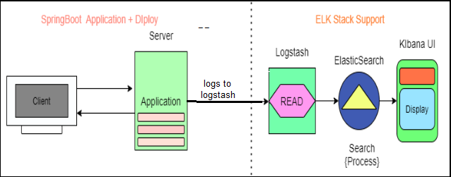

# Error-Logging-Elk Application Development
SpringBoot Application Development with Docker using ElasticSearch Logstash and Kibana.

````
SpringBoot_E_L_K
.
├── HELP.md
├── Readme.md
├── config
│   └── logstash.conf
├── docker-compose.yml
├── mvnw
├── mvnw.cmd
├── pom.xml
├── request.http
└── src
    ├── main
    │   ├── java
    │   │   └── com
    │   │       └── elk
    │   │           ├── SpringBootELKApplication.java
    │   │           ├── controller
    │   │           │   ├── SchoolController.java
    │   │           │   └── StudentController.java
    │   │           ├── entity
    │   │           │   ├── School.java
    │   │           │   └── Student.java
    │   │           ├── exception
    │   │           │   ├── ApiErrorResponse.java
    │   │           │   ├── ApiValidationErrorResponse.java
    │   │           │   └── ExceptionHandler.java
    │   │           ├── repo
    │   │           │   ├── SchoolRepo.java
    │   │           │   └── StudentRepo.java
    │   │           └── service
    │   │               ├── SchoolService.java
    │   │               └── StudentService.java
    │   └── resources
    │       ├── application.properties
    │       ├── logback-spring.xml
    │       ├── static
    │       │   └── img.png
    │       └── templates
    └── test
        └── java
            └── com
                └── elk
                    └── SpringBootELKApplicationTests.java
 ````                  
                    
## Steps to run sample

```
    # Run Error-Logging-Elk SpringBoot Application 
    mvn spring-boot:run
    
    # Start docker containers 
    docker-compose up -d
```


## ELK Stack
Any application will be deployed in a location that provides a log message to a Logfile.
A text type internally ,Searching details (Error, Warning) is a bit complex task So,we are using ELK for easy search of log file data.

ElasticSearch-https://www.elastic.co/elasticsearch <br>
Logstash-https://www.elastic.co/logstash <br>
Kibana-https://www.elastic.co/kibana <br>

    1)ElasticSearch :    Search Engine (based on JSON) Distributed even ,Supports Analytics.

    2)Logstash :         Logstash is an open source data collection engine with real-time pipelining capabilities.
       Logstash can dynamically unify data from disparate sources and normalize the data into destinations of your choice. 
       Cleanse and democratize all your data for diverse advanced downstream analytics and visualization use cases.

    3)Kibana :           UI where it will display our file data 

```
ElasticSearch server url - http://192.168.0.253:9200/
Logstash server url      - http://192.168.0.253:5959
kibana server url        - http://192.168.0.253:5601/
```
    ELK Integration with springboot application
